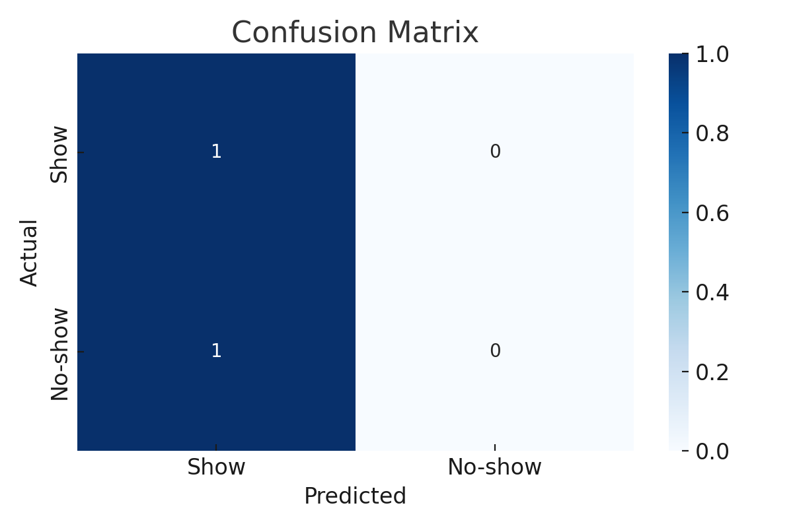
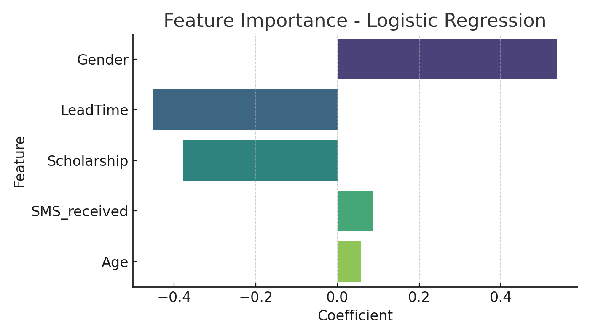

# 🏥 Healthcare No-show Prediction

This project uses logistic regression to predict whether a patient will miss their medical appointment based on features such as age, SMS reminders, scholarship enrollment, and lead time.

---

## 📊 Dataset
- 6 sample patient appointments (from public no-show dataset)
- Features: Gender, Age, Scholarship, SMS_received, ScheduledDay, AppointmentDay
- Target: No-show (`Yes` or `No`)

---

## ⚙️ Methodology
- Feature engineering (e.g., calculating lead time between scheduled and appointment dates)
- Logistic regression model using scikit-learn
- Evaluation: Confusion matrix, classification report
- Feature importance visualization

---

## 📈 Results

### Confusion Matrix  

### Feature Importance  

---

## 💡 Business Insight
- Patients who received an SMS and had longer lead time were more likely to show up
- Hospitals can optimize communication and scheduling to reduce no-show rates

---

## 👤 Author
**Suvathi Mariyappan Lakshmi**  
[LinkedIn](https://linkedin.com/in/suvathi-m) • [Tableau Portfolio](https://public.tableau.com/app/profile/suvathi.mariyappan.lakshmi/vizzes)
